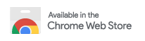

# 油猴脚本指南

## 安装脚本管理器

要使用用户脚本，您首先需要安装一个用户脚本管理器。您可以根据当前使用的浏览器来选择一个用户脚本管理器：

脚本管理器的功能是通过编写脚本对网页进行任意更改，所以成为了最受欢迎的浏览器插件之一

>油猴子究竟能做什么呢?他说一个脚本引擎。相对于扩展，脚本更轻量级，不占用太多资源并且只在特定的站点生效。他能够通过最简单的脚本来更改一个网站或者网页的布局、外观、操作。发现某个网站用起来费劲，没关系，找个油猴脚本;发现网站变形，没关系，说不定已经有油猴脚本帮你纠正了;网站隐藏图片链接或者找不到视频下载链接，没问题，油猴子脚本同样可以帮助你;想让网站背景图换成自己女友的，没问题，写个油猴子脚本轻松搞定……

**Chrome:** Tampermonkey 或 Violentmonkey

**Firefox:** Greasemonkey、Tampermonkey 或 Violentmonkey

**Safari:** Tampermonkey 或 Userscripts

**Microsoft edge:** Tampermonkey

**Opera:** Tampermonkey 或 Violentmonkey

**Maxthon:** Violentmonkey

**Dolphin:** Tampermonkey

**UC:** Tampermonkey

### [Tampermonkey 油猴](https://www.tampermonkey.net/)

在使用 chromium 内核的浏览器中通常选择 Tampermonkey 作为脚本管理器

>Tampermonkey 是一款免费的浏览器扩展和最为流行的用户脚本管理器，它适用于 Chrome, Microsoft Edge, Safari, Opera Next, 和 Firefox。

### [Violentmonkey 暴力猴](https://violentmonkey.github.io/)

>暴力猴插件是一款和油猴插件齐名的浏览器插件,它同样可以帮助用户们去安装和管理游览器上的各类插件
>
>Violentmonkey 浏览器油猴插件，与 Tampermonkey 齐名，中文译名“暴力猴”，支持 Userscripts.org、GreasyFork、OpenUserJS三大脚本下载源

[GitHub Releases](https://github.com/violentmonkey/violentmonkey/releases)

### [Greasemonkey 油猴子](https://www.greasespot.net/)

火狐浏览器用户可用 Greasemonkey 获得更好的体验

 >Greasemonkey 官方版是火狐浏览器的一款实用的脚本插件,Greasemonkey 官方版软件也是最能体现火狐可定制性的强大的扩展之一,国内用户喜欢称其为“油猴子”

---

## 如何安装脚本

在安装好tampermonkey后，比如我们想找一个脚本。

可以点击 [用户脚本](https://www.tampermonkey.net/scripts.php)，这个网页推荐了几个获取油猴脚本的网站，我们点击 [Greasy Fork](https://greasyfork.org/zh-CN) ，这个网站比较活跃；

在搜索栏输入关键词或者网站域名并搜索；

在搜索结果页点击搜索到的脚本，可以看到他的安装量和最近更新日期，我们尽量选择近期有更新的脚本，时间太久的脚本可能会失效。

点击 `安装此脚本` 在新弹出的页面点击 `安装`

点击一下油猴的图标，可以看到脚本已经安装完成并处于开启状态了。

需要什么脚本。就在 [Greasy Fork](https://greasyfork.org/zh-CN) 这个网站上搜索。

## 恶意油猴脚本

恶意脚本可能违背您的意愿进行操作从而侵犯您的隐私！
您应当仅从信任的来源安装脚本。

- 使用油猴里的脚本有可能会

    获取你浏览器中除去浏览器限制页面(浏览器官方页面)外的所有信息 `所有信息`

- 包括但不限于:

    `密码泄露` `数据造假`

在安装脚本时会显示脚本所需要加载的URL,随意安装第三方插件可能导致你的所有个人信息被获取，所以要安装油猴脚本，应该在安装新插件前，多阅读评论，并查看插件的源代码是否有明显异常，谨慎下载安装。

在 greasyfork 中安装的插件在发现恶意行为后会自动启用更新插件使之失效

而在 GitHub 中安装的软件并没有一个合法的第三方审查方，如果没有人去审查代码，可能有危险行为都无人发现

>有些黑客精心地设计了恶意的脚本程序，它们的功能有点复杂和隐蔽，他们利用这些恶意插件来赚钱。和其他的浏览器插件一样，恶意的浏览器插件也可以访问浏览器所做的一切。一旦安装了恶意插件，它们就可以记录您的浏览活动和您在浏览器上使用的信息，随后，敏感信息将落入网络黑客手中。此外，他们还会在你的浏览器中插入商业广告，当你打开浏览器或者在网上浏览网页时，许多广告窗口会弹出。
>
>总之，恶意的脚本对您造成的损害是相当大的，必须密切注意您使用的浏览器扩展插件，如果你看到任何可疑的东西，尽快把它删除掉，以绝后患。
>
>虽然有些浏览器扩展插件不友好，但我们不能拒绝所有合法插件程序。从合法的网站或者浏览器本身的网上商店下载合法的扩展插件确实给你上网带来了便利和优势，因为可以在浏览器插件的帮助下享受满意的上网浏览体验。同时，要小心谨慎，认清邪恶的插件程序。如果您不确定它是否是一个好的扩展插件，您可以这样问自己，“既然我安装了这个插件，我的浏览器运行速度会变慢吗？广告窗口经常弹出吗？浏览器上是否有以前没有安装的奇怪程序或插件？你的浏览器行为怪异吗？您的浏览器是否将您重定向到未知网站？如果你对自己说：“是”。你必须小心，您的计算机上存在潜在风险。你必须尽快删除它。

### 类似视频

[帐号被盗？卡被盗刷？几行代码演示油猴的恐怖！油猴脚本才是实至名归的超级马槽! @BiliBili](https://www.bilibili.com/video/av638248302)

[[科普]油猴脚本安全性分析!看完你绝对惊出一身冷汗 @BiliBili](https://www.bilibili.com/video/av671990095/)

### 官方文档摘要

内容使用翻译软件自动翻译

#### Q300：Tampermonkey可以访问我访问的每个页面！TM是邪恶的吗？

::: details A300

...就像任何其他具有https和http访问权限的Chrome扩展程序一样

这包括AdBlock，ScriptSafe，Avast Online Security等扩展程序，并且由于下载时未显式显示，因此任何作为本机Chrome扩展程序安装的用户脚本。

如果您对此感兴趣，可以通过搜索“此扩展程序可以访问”，在 Chrome 商店中每个扩展程序的右列中找到访问信息。
Tampermonkey需要能够在每个页面上运行，因为它不知道您的用户脚本将在哪些页面运行，因此需要能够将它们注入每个页面。

但你是对的，用户脚本和扩展可能会损害你的隐私和你的电脑。然而，我认为更邪恶的是，当安装时，Chrome不会显示在用户脚本想要运行的页面>上，因为它是作为本机扩展安装的。从这个角度来看，TM甚至可以给你带来一些安全感，至少如果你相信我的话，我对你的任何数据都不感兴趣。如>果没有，您可以打开控制台 （Ctrl-Shift-J） 并选择网络选项卡来调查执行的网络通信。:)

:::

#### Q304： 运行 Tampermonkey 需要哪些权限，为什么？

::: details A304

Tampermonkey 需要以下权限。其中一些在某些浏览器中可能是可选的，并且仅在使用时才需要授予。

- 通知 notifications

    对于GM_通知，请参阅相关通知

    for GM_notification, Tampermonkey related notifications

- 标签 tabs

    查找活动选项卡并导航，创建和关闭选项卡

    to find the active tab and navigate, create and close tabs in general

- idle

    在玩游戏时不显示更新通知

    to not show update notifications if your playing a game

- 网络导航 webNavigation

    安装用户脚本，检查 URL 中是否有匹配的脚本

    install userscripts, check URLs for matching scripts

- 网络请求+阻止网络请求 webRequest+webRequestBlockinstall

    userscripts，检查 URL 中是否有匹配的脚本，修改GM_xmlhttpRequest的请求详细信息

    install userscripts, check URLs for matching scripts, modify request details for GM_xmlhttpRequest

- 存储 storage

    以存储您的用户脚本

    to store your userscripts

- 无限制存储 unlimitedStorage

    以存储许多用户脚本 🤓

    to store many of your userscripts 🤓

- 上下文菜单 contextMenus

    在上下文菜单中运行@run

    for @run-at context-menu

- chrome://favicon/

    轻松获取页面的图标

    to easily get the favicons of pages

- 读写剪贴板 clipboardWrite

    for GM_setClipboard

- cookie （储存在用户本地终端上的数据）

    GM_xmlhttpRequest， GM_cookies

- \<all_urls\>

    在每个页面上运行用户脚本，并允许他们修改页面

    to run your userscripts at every page and to allow them to modify the page

- 下载

    GM_downloads， 存储 篡改 Tampermonkey 备份

    GM_downloads, storing Tampermonkey backups

##### 在 Chrome 中，这些权限将转换为

- 读取浏览历史记录
- 显示通知
- 修改复制和粘贴的数据

特别是第一个看起来有点奇怪。事实上，Tampermonkey在安装时无法访问您的浏览器历史记录。从理论上讲，Tampermonkey可以访问所有当前打开的选项卡的历史记录，并在安装后存储“新”历史记录，但这既不需要也不需要。但是，由于这一事实，Chrome团队可能认为打印太宽泛的警告比过于扁平的警告要好。还有一个错误报告。

##### 在火狐浏览器中，这转化为

- 访问所有网站的数据
- 将数据输入剪贴板
- 下载文件并读取和修改浏览器的下载历史记录
- 向您显示通知
- 访问浏览器选项卡
- 存储无限量的客户端数据
- 在导航期间访问浏览器活动

:::
